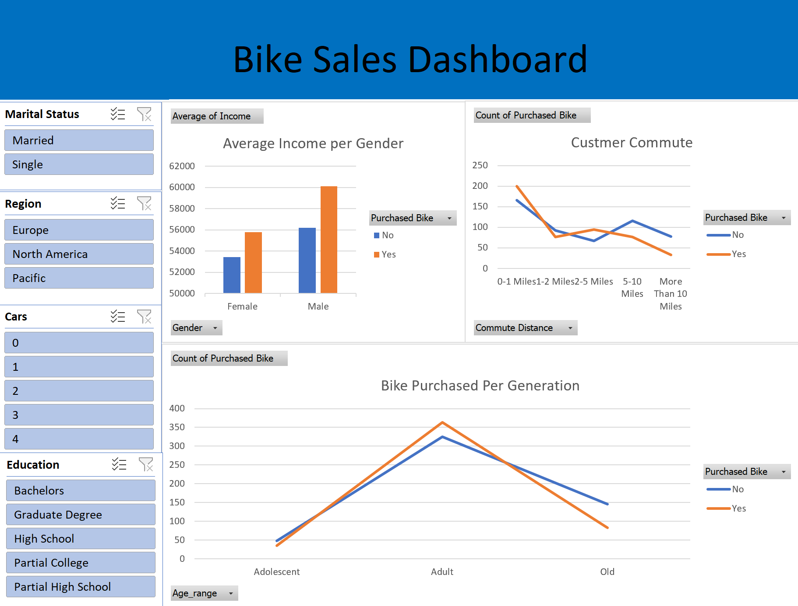

# Bike Purchases Data Cleaning Dashboard

## Summary

An analysis of 1,000 bike purchase records in Excel. Build pivot tables to surface trends by income, commute distance, education, and region—and tie it together with an interactive dashboard preview.

## Data Description

- **Rows:** 1,000 customer records
- **Key fields:**
  - `CustomerID`
  - `Age`
  - `Gender`
  - `Education`
  - `Income`
  - `CommuteDistance`
  - `Region`
  - `Cars`

## Project Steps

### 1. Data Cleaning (Excel)

1. Removed duplicate and blank rows for data integrity.
3. Standardized text fields (e.g., unified “Master’s” vs. “Masters”).
4. Created column (Age range).

### 2. Pivot Table Analysis

- Created pivot tables to summarize:
  - Breakdown of purchase count by commute-distance category
  - Count of bike perchsed by age range
  - Gender purchase comparison

### 3. Interactive Dashboard

- Assembled slicers (Cars, Region, Marital Status, Education) to filter dynamically
- Vriety of charts (area chart, bar chart)